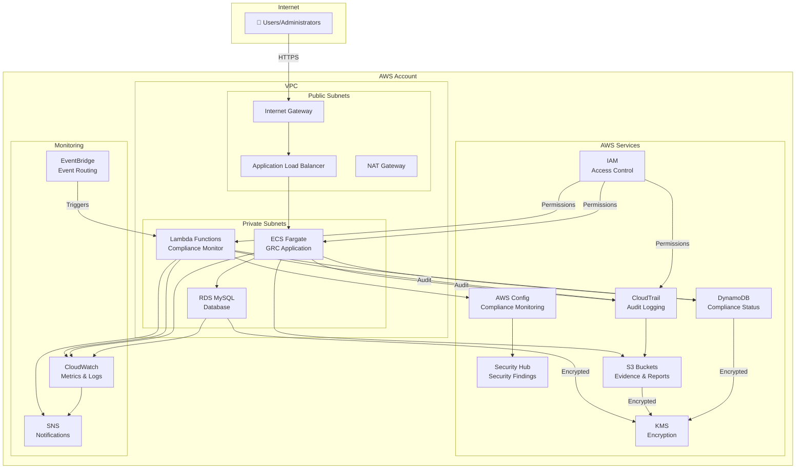
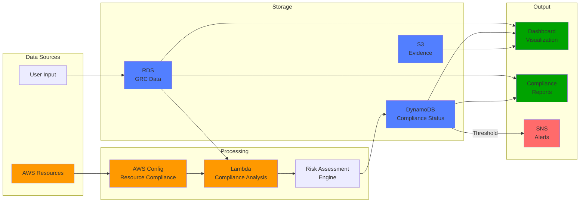
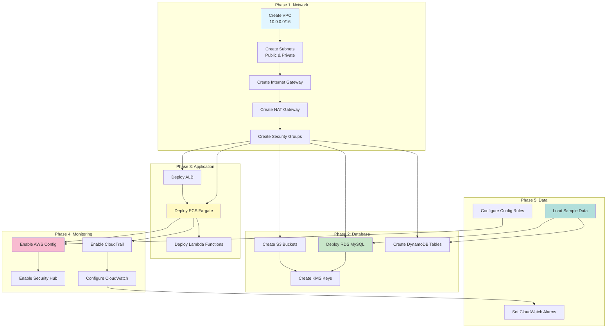
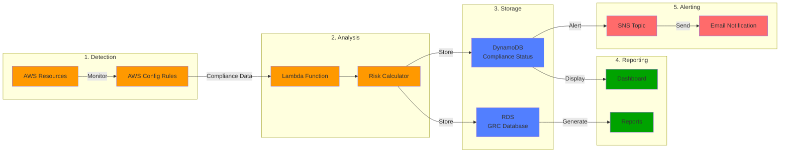
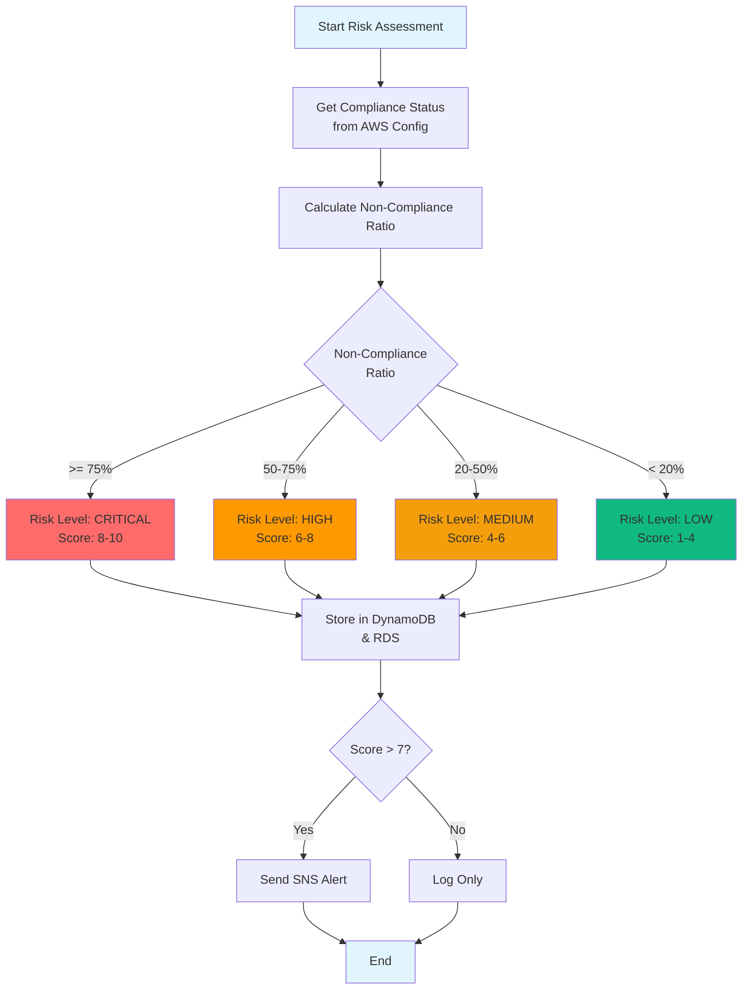
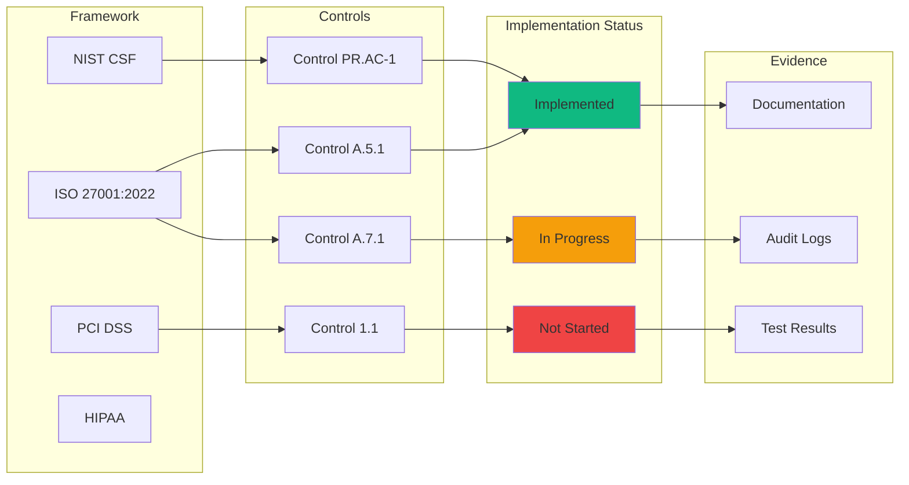
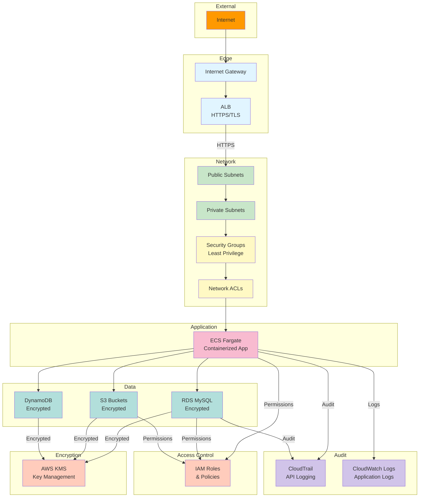
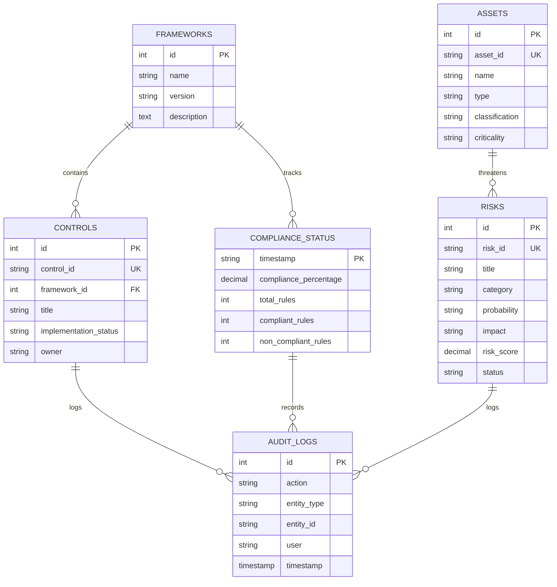
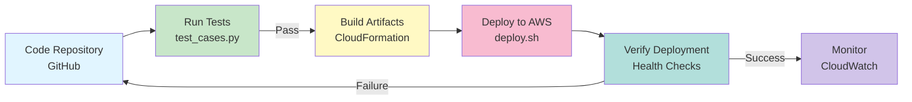

# GRC Platform - Architecture Diagrams

## System Architecture Overview

## Data Flow Diagram

## Deployment Architecture

## Compliance Monitoring Flow

## Risk Assessment Workflow

## Control Implementation Tracking

## Security Architecture

## Database Schema Relationships

## Deployment Pipeline

## Component Interaction Matrix

| Component | Interacts With | Purpose |
|-----------|----------------|---------|
| AWS Config | Lambda, RDS, DynamoDB | Provides compliance data |
| Lambda | Config, RDS, DynamoDB, SNS | Analyzes compliance and triggers alerts |
| RDS | ECS, Lambda, Dashboard | Stores GRC data |
| DynamoDB | Lambda, Dashboard | Stores real-time compliance status |
| S3 | ECS, CloudTrail | Stores evidence and audit logs |
| CloudTrail | S3, CloudWatch | Logs all API calls |
| Security Hub | Config, CloudWatch | Aggregates security findings |
| CloudWatch | All services | Monitors metrics and logs |
| SNS | Lambda, CloudWatch | Sends notifications |
| IAM | All services | Controls access |
| KMS | RDS, S3, DynamoDB | Encrypts data |

## Key Integration Points

1. **AWS Config → Lambda**: Compliance data triggers Lambda for analysis
2. **Lambda → DynamoDB**: Real-time compliance status storage
3. **Lambda → SNS**: Alert notifications for non-compliance
4. **RDS ↔ Dashboard**: Display GRC data and user input
5. **CloudTrail → S3**: Audit logging for compliance
6. **Security Hub → Dashboard**: Security findings aggregation
7. **CloudWatch → Alarms**: Threshold-based alerting

This architecture ensures a secure, scalable, and compliant GRC platform that integrates seamlessly with AWS services for continuous monitoring and reporting.
